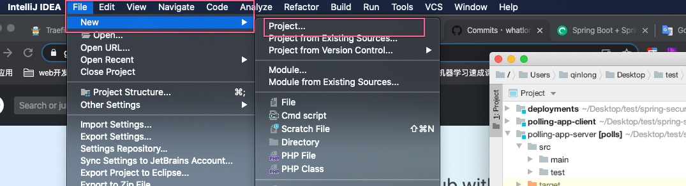
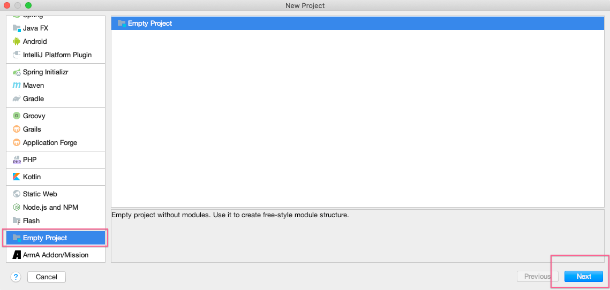
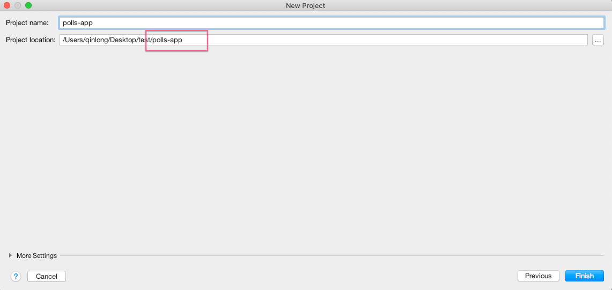
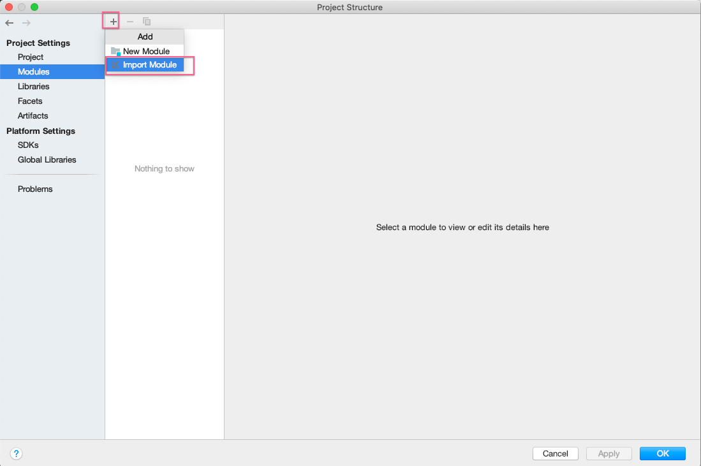
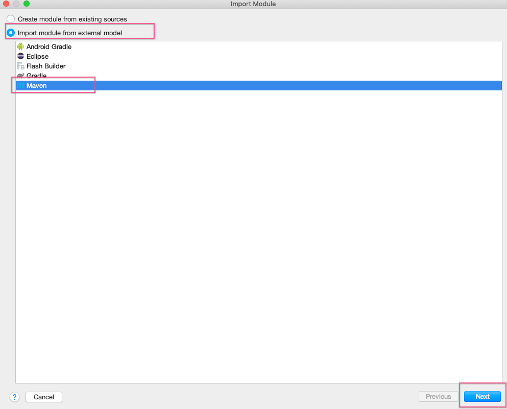
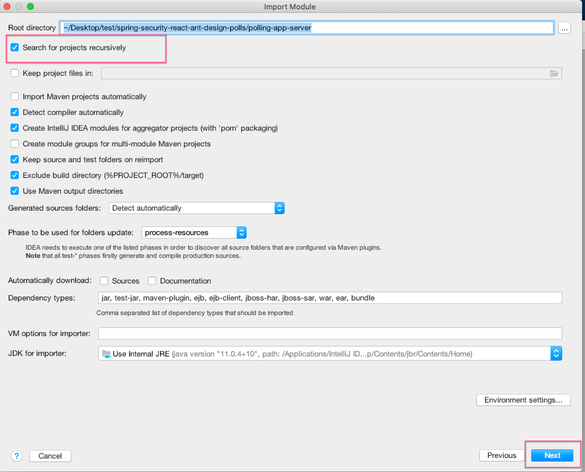
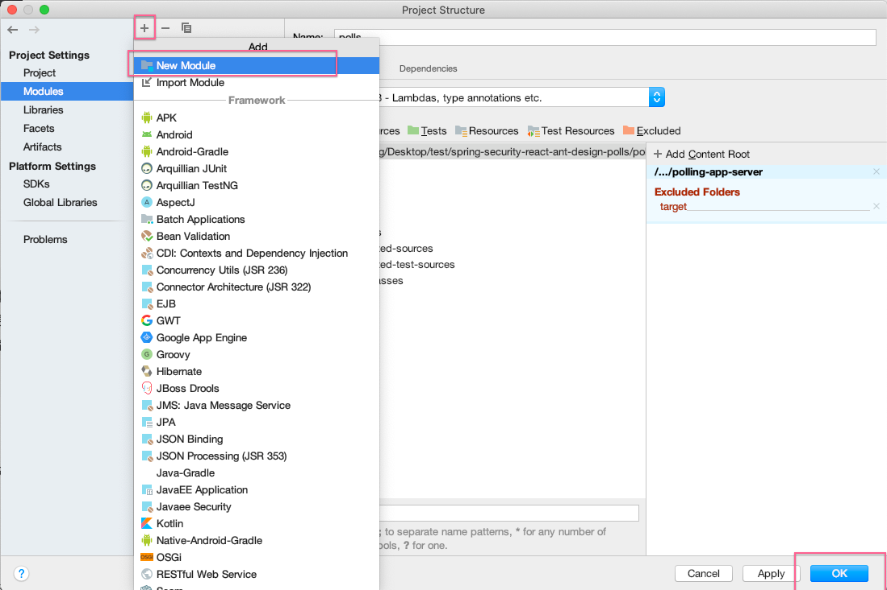
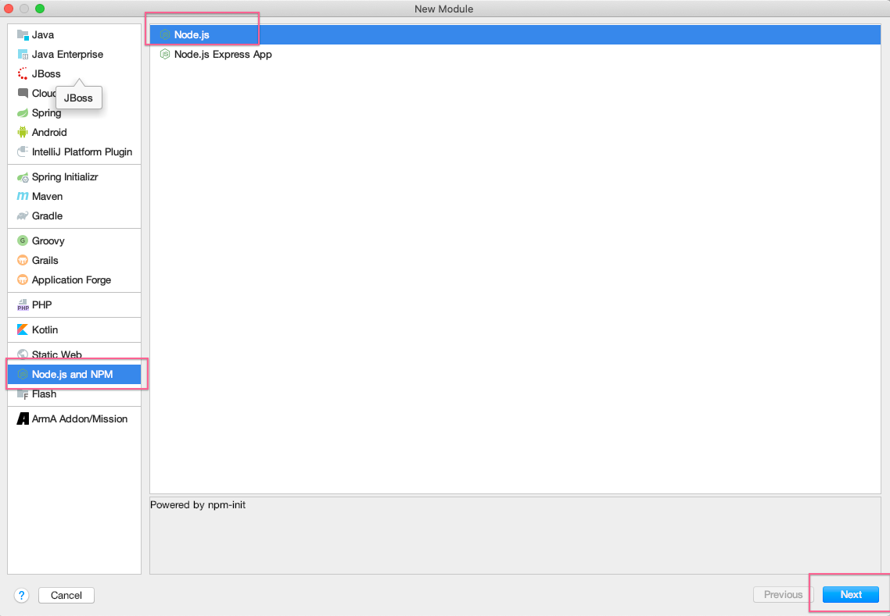
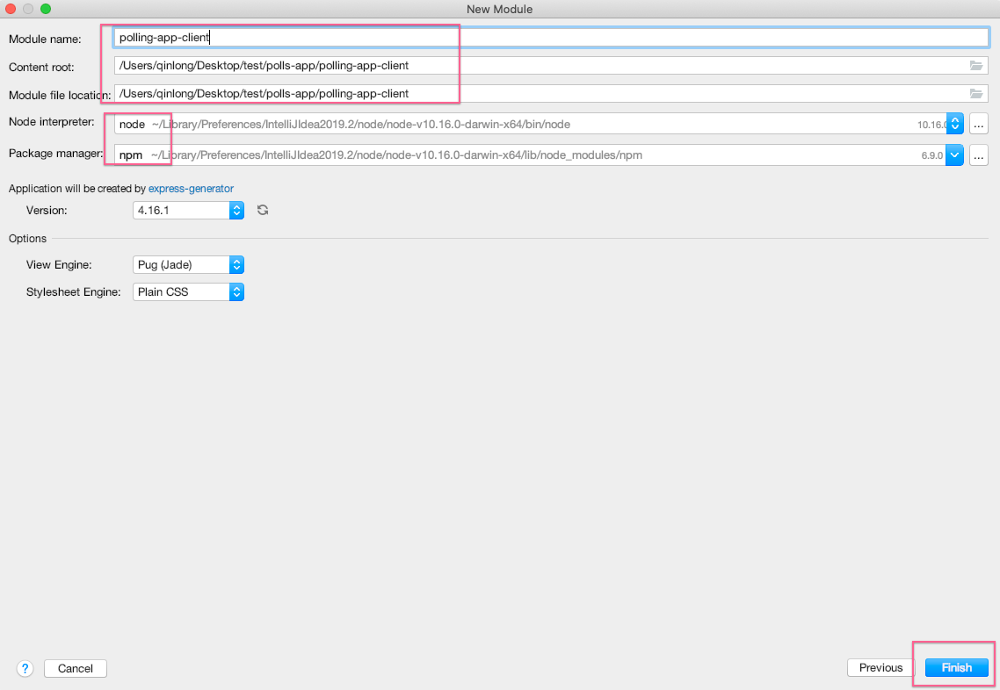
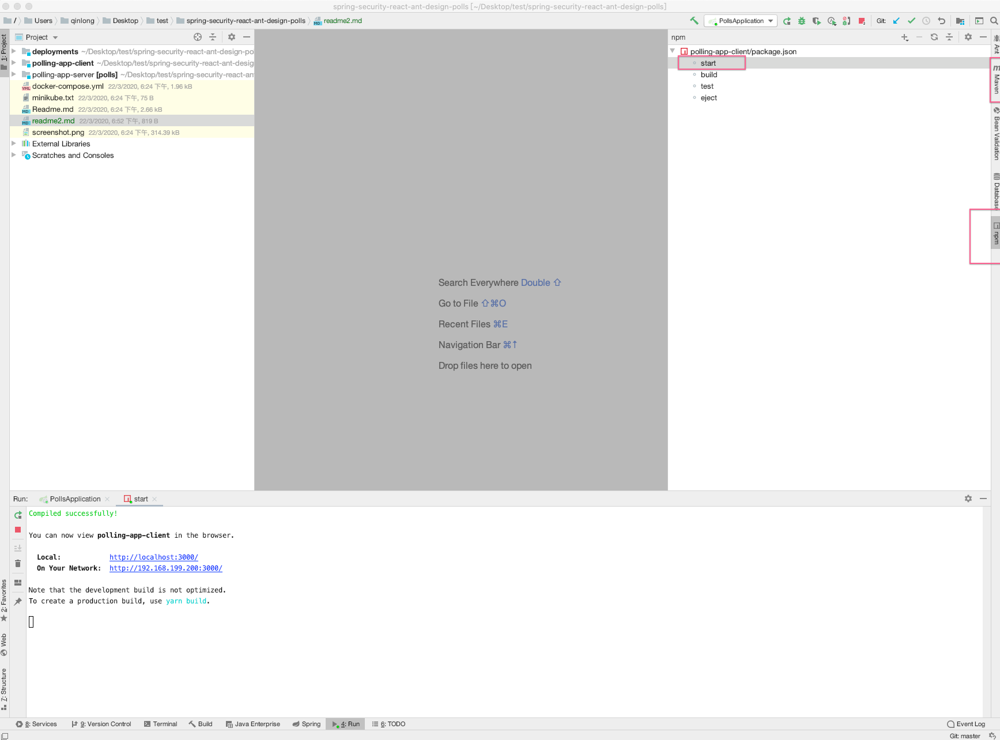

# 本地ideal集成日志

说明，这个项目中包含三部分，一个maven的java工程，一个nodejs工程，一个配置文件工程，按照如下方式导入

步骤：
1. 新建一个空的工程
 

2. 添加这个空project下的modules

* 后端工程是一个java工程

接下来一直next即可

* 添加nodejs这个前段工程

* 第三个清单文件，当成普通资源导入即可

注意页面中会出现nodejs的运行区块

